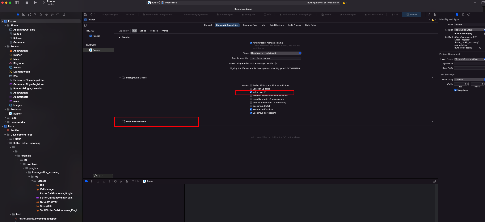
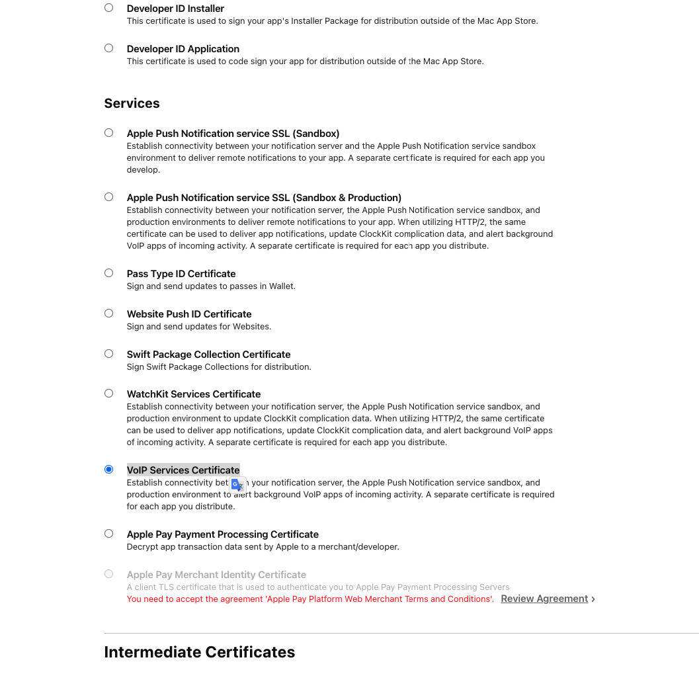
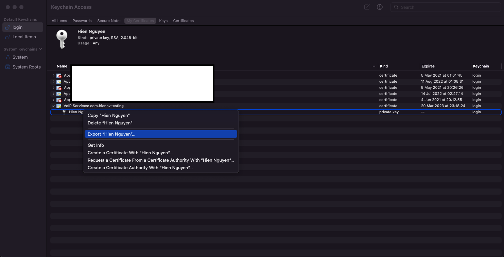
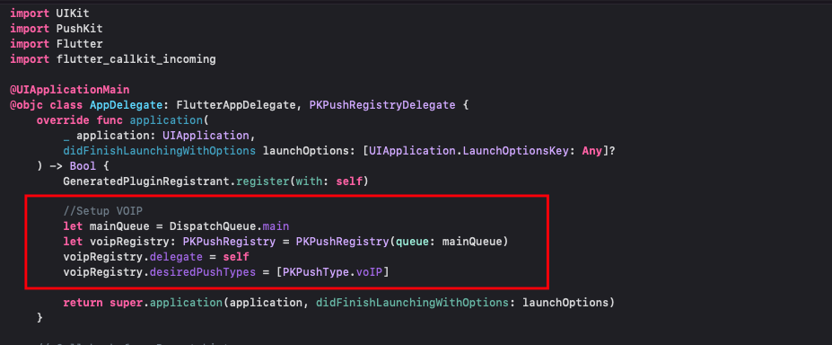
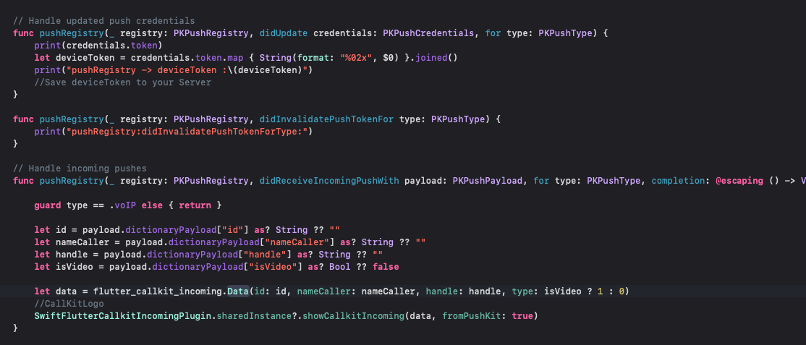
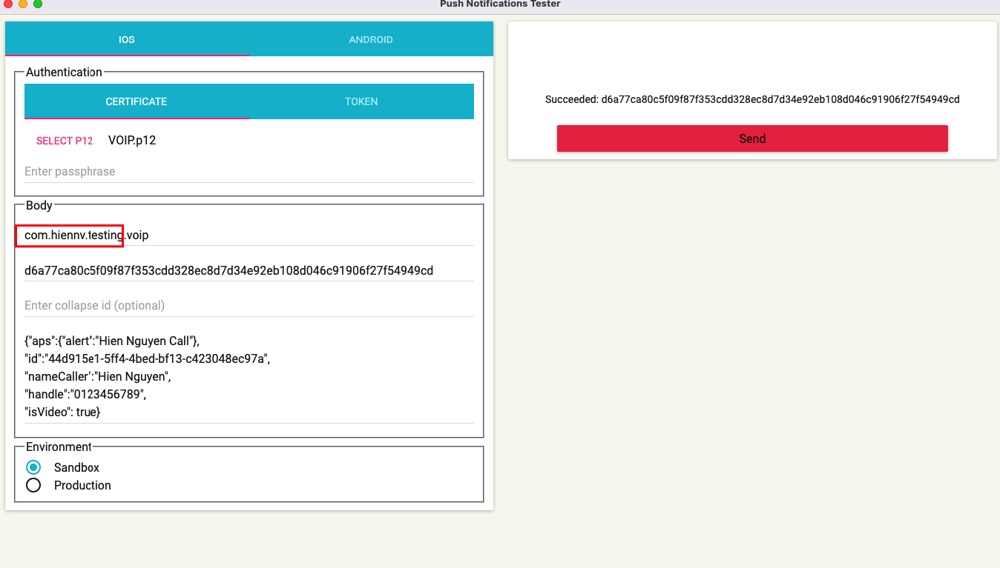

# Flutter Callkit Incoming

Setup Pushkit for IOS.

If you are making VoIP application than you definitely want to update your application in the background state as well as wake your application when any VoIP call is being received.

## 🚀&nbsp; Setup

1. Enable Voice over IP Setting

  * Xcode Project > Capabilities
    
  * VoIP Services Certificate

  Go to https://developer.apple.com/account/resources/certificates/add
  

  Download the certificate and install it into the Keychain Access app(download .cer and double click to install).

  * Export .p12
  
  * Convert .p12 to .pem
    ```console
      openssl pkcs12 -in YOUR_CERTIFICATES.p12 -out VOIP.pem -nodes -clcerts
    ```

2. Configure VoIP Push Notifications in Xcode project (Swift)
  
  
  

  // Start call from Recent history on click (add if necessary)

  

3. Testing
  * App Using
    https://github.com/onmyway133/PushNotifications

    
  * 
<table>
  <tr>
    <td>iOS(Lockscreen)</td>
    <td>iOS(full screen)</td>
    <td>iOS(Alert)</td>
  </tr>
  <tr>
    <td>
      
    </td>
    <td>
      
    </td>
    <td>
      
    </td>
  </tr>
  <tr>
    <td>Android(Lockscreen) - Audio</td>
    <td>Android(Alert) - Audio</td>
    <td>Android(Lockscreen) - Video</td>
  </tr>
  <tr>
    <td>
      
    </td>
    <td>
      
    </td>
    <td>
      
    </td>
  </tr>
  <tr>
    <td>Android(Alert) - Video</td>
    <td>isCustomNotification: false</td>
    <td></td>
  </tr>
  <tr>
    <td>
      
    </td>
    <td>
      
    </td>
  </tr>
 </table>
